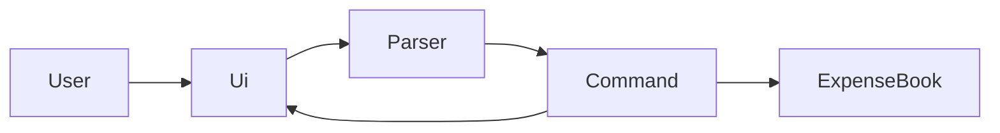

# Budgie Developer Guide

This developer guide describes **v0.3** of Budgie, a personal budget tracker chatbot for CS3227 MP1.

## 1. Setting up

1. Clone the repository and install **Java 17**.
2. Run `./gradlew check` to execute unit tests and Checkstyle.
3. Run `./gradlew run` to start the CLI.

IDE: import the Gradle project. Do not commit IDE-specific files.

## 2. Design overview

v0.3 uses a small command loop with an in-memory book of expenses and incomes:

- `Budgie` — application entry point and command loop
- `Ui` — read input, print messages
- `Parser` — map a line of text to a `Command`; throw `BudgieException` for bad `expense` or `income` arguments
- `Command` — execute against `ExpenseBook` and report whether to exit
- `Expense` / `Income` / `ExpenseBook` — session-only model (not persisted)

Command objects: `HelpCommand`, `ExitCommand`, `UnknownCommand`, `AddExpenseCommand`, `AddIncomeCommand`. List, delete, and storage are not implemented yet.

## 3. Current implementation notes

- The command word is case-insensitive; expense descriptions keep the user's capitalisation.
- Blank lines are skipped in `Budgie.run()`.
- `Parser` uses an assertion that input is non-null (internal assumption).
- Invalid `expense` or `income` format or amount is a `BudgieException` shown to the user.
- Other unknown text still goes through `UnknownCommand`.
- `ExpenseBook` is in memory only. Closing the app discards expenses and incomes.

## 4. Testing

- JUnit 5 tests live under `src/test/java`.
- `ParserTest` covers `help`, `bye`, unknown input, valid/invalid `expense`, and valid/invalid `income`.
- `AddExpenseCommandTest` and `AddIncomeCommandTest` check that execute adds to `ExpenseBook`.
- `HelpCommandTest` checks the help text stays consistent with the User Guide.
- Run the full gate with `./gradlew check`.
- GUI tests are not applicable yet (CLI only).

CI: GitHub Actions (`.github/workflows/gradle.yml`) runs `./gradlew check` on pushes and pull requests to `master`.

## 5. Software engineering process

Work is **increment-based**: one user-visible feature (or one engineering increment such as CI) per change set.

- `AGENTS.md` records the AI-assisted workflow for this repo.
- After each increment, a session summary is added under `logs/` and a stub is appended to `docs/Reflections.md`. Joseph rewrites stubs in first person.
- GitHub Issues and milestones will be used once increments beyond v0.1 start, so project history stays visible.

## 6. Acknowledgements

- CS2103/T [Project Duke trimmed for CS3227](https://nus-cs2103-ay2627-s1.github.io/website/projectDuke/cs3227.html) AI Guidance (increment style, agent files, test-after-change).
- [SE-EDU Java coding standard](https://se-education.org/guides/conventions/java/intermediate.html) and Git commit convention.
- Checkstyle rules adapted from [AddressBook Level 3](https://github.com/se-edu/addressbook-level3).
- Gradle / JUnit / Checkstyle / GitHub Actions tutorials at [se-education.org/guides](https://se-education.org/guides/).
