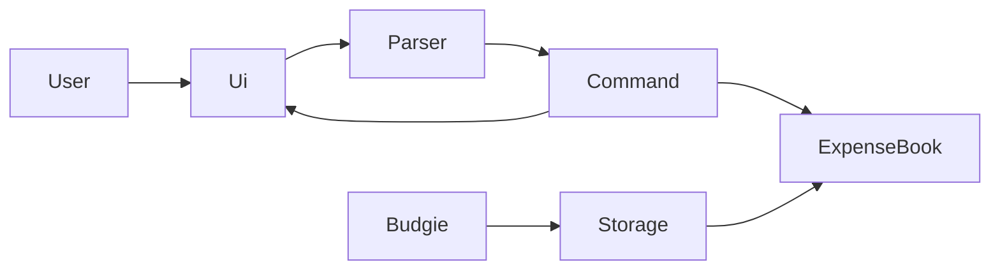

# Budgie Developer Guide

This developer guide describes **v0.7** of Budgie, a personal budget tracker chatbot for CS3227 MP1.

## 1. Setting up

1. Clone the repository and install **Java 17**.
2. Run `./gradlew check` to execute unit tests and Checkstyle.
3. Run `./gradlew run` to start the CLI.

IDE: import the Gradle project. Do not commit IDE-specific files. Runtime data under `data/` is gitignored.

## 2. Design overview

v0.7 uses a small command loop, an in-memory book, and a text save file:

- `Budgie` — application entry point and command loop; loads on start and saves after mutating commands
- `Ui` — read input, print messages
- `Parser` — map a line of text to a `Command`; throw `BudgieException` for bad arguments
- `Command` — execute against `ExpenseBook` and report whether to exit; `modifiesData()` is true for add and delete
- `Expense` / `Income` implement `Entry`; `ExpenseBook` stores them in insertion order; `delete` uses 1-based `list` indexes
- `Storage` — read/write `data/budgie.txt`

GUI is not implemented yet.

## 3. Current implementation notes

- The command word is case-insensitive; expense descriptions keep the user's capitalisation.
- Blank lines are skipped in `Budgie.run()`.
- `Parser` uses an assertion that input is non-null (internal assumption).
- Invalid `expense` / `income` format, missing amount, negative amount, bad `delete` indexes, and missing delete index are `BudgieException`s shown to the user.
- Missing amount (`expense` with no amount token, or an argument list that starts with `/category`) is a separate message from the general usage string.
- Negative amounts use `Amount cannot be negative.`; zero and extra decimals share the generic amount message.
- Other unknown text still goes through `UnknownCommand`.
- Save format is one line per transaction: `E|12.50|food|lunch` or `I|2500.00|salary|August pay`. The last field is the rest of the line, so descriptions may contain `|`.
- A missing save file starts an empty book. Invalid lines are skipped and counted. Saving after a mutating command includes the empty-book case so deletes are not undone on the next launch.
- If saving fails, the user still sees the command result plus a save-error line.

## 4. Testing

- JUnit 5 tests live under `src/test/java`.
- `ParserTest` covers `help`, `bye`, `list`, `delete`, unknown input, missing amount, negative amount, and other valid/invalid `expense` and `income` cases.
- `ListCommandTest` checks empty-book output and mixed insertion order.
- `DeleteCommandTest` checks a valid delete, an out-of-range index message, and delete on an empty book.
- `AddExpenseCommandTest` and `AddIncomeCommandTest` check that execute adds to `ExpenseBook`.
- `HelpCommandTest` checks the help text stays consistent with the User Guide.
- `StorageTest` covers missing file, round-trip (including `|` in a description), save-after-delete, empty file after deleting the last row, and skipped corrupt lines.
- Run the full gate with `./gradlew check`.
- GUI tests are not applicable yet (CLI only).

CI: GitHub Actions (`.github/workflows/gradle.yml`) runs `./gradlew check` on pushes and pull requests to `master`.

## 5. Software engineering process

Work is **increment-based**: one user-visible feature (or one engineering increment such as CI) per change set.

- `AGENTS.md` records the AI-assisted workflow for this repo.
- After each increment, a session summary is added under `logs/` and a stub is appended to `docs/Reflections.md`. Joseph rewrites stubs in first person.
- GitHub Issues and milestones will be used once increments beyond v0.1 start, so project history stays visible.

## 6. Acknowledgements

- CS2103/T [Project Duke trimmed for CS3227](https://nus-cs2103-ay2627-s1.github.io/website/projectDuke/cs3227.html) AI Guidance (increment style, agent files, test-after-change).
- [SE-EDU Java coding standard](https://se-education.org/guides/conventions/java/intermediate.html) and Git commit convention.
- Checkstyle rules adapted from [AddressBook Level 3](https://github.com/se-edu/addressbook-level3).
- Gradle / JUnit / Checkstyle / GitHub Actions tutorials at [se-education.org/guides](https://se-education.org/guides/).
