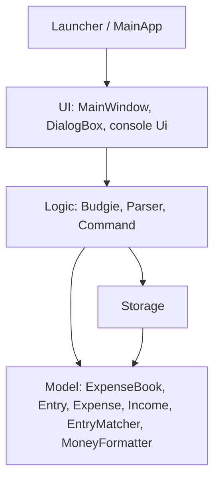
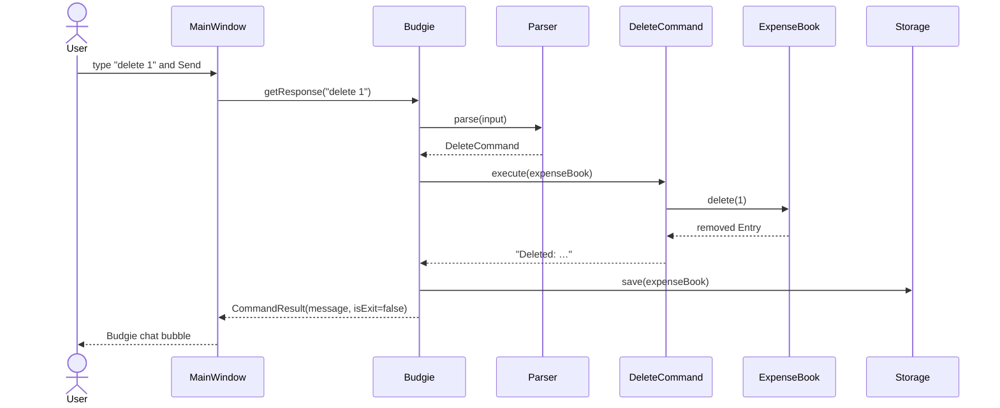
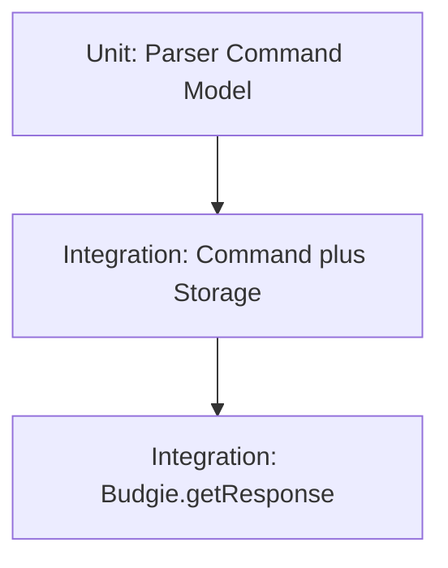

# Budgie Developer Guide

This developer guide describes **v1.2** of Budgie, a personal budget tracker chatbot for CS3227 MP1.

## Setting up

1. Clone the repository and install **Java 17**.
2. Run `./gradlew check` to execute unit tests and Checkstyle.
3. Run `./gradlew run` to start the JavaFX GUI. Use `./gradlew runCli` for the text-only CLI.
4. Run `./gradlew release` to build `release/budgie.jar` (fat JAR with JavaFX). Gradle also writes `build/libs/budgie.jar`.

IDE: import the Gradle project. Do not commit IDE-specific files. Runtime data under `data/` is gitignored.

### Build for submission

CS3227 expects a **`release/`** folder containing the latest fat JAR:

```bash
./gradlew release
java -jar release/budgie.jar
```

Sanity-check repo layout (TA script):

```bash
./check_mp1_structure.sh .
```

The `release/` folder is tracked in git; `build/` is gitignored. Re-run `./gradlew release` before submission or tagging a GitHub Release so `release/budgie.jar` matches the current source.

## Design

### Architecture

Budgie follows the same component split as SE-EDU AddressBook-style apps: **UI**, **Logic**, **Model**, and **Storage**. That is an MVC-style design: the UI shows messages, Logic interprets commands, Model holds transactions in memory, Storage persists them.



**`Launcher` and `MainApp`** start and shut down the GUI. `Launcher` does not extend `Application`; that avoids the “JavaFX runtime components are missing” error when running a fat JAR. `MainApp` loads `MainWindow.fxml` and hands a `Budgie` instance to the window. `Budgie.main` is the text CLI entry point (`./gradlew runCli`).

The four components:

- **[UI](#ui-component)** — JavaFX chat window and optional console I/O.
- **[Logic](#logic-component)** — parse a line, execute a command, return a `CommandResult`.
- **[Model](#model-component)** — in-memory list of expenses and incomes.
- **[Storage](#storage-component)** — `data/budgie.txt`.

#### Sequence: user types `delete 1`



`expense` and `income` follow the same path, with `AddExpenseCommand` / `AddIncomeCommand` instead of `DeleteCommand`. `help`, `list`, `find`, and `summary` skip `Storage.save` because `Command.modifiesData()` is false. `bye` returns `isExit == true`; the window shows the goodbye line, then closes after a short delay.

### UI component

**Classes:** `seedu.budgie.ui.MainWindow`, `DialogBox`, `Ui` (console), plus `MainApp` / `Launcher`.

The GUI is a JavaFX `AnchorPane` defined in `src/main/resources/view/MainWindow.fxml`, styled by `MainWindow.css`.

- `MainWindow` binds the scroll pane to the dialog list, sends the text field to `Budgie.getResponse`, and appends `DialogBox` bubbles (user on the right, Budgie on the left).
- `DialogBox` is a small `HBox` bubble; there are no avatar image files.
- Console `Ui` prints divider lines and reads `System.in` for `./gradlew runCli`.

The UI component:

- does **not** parse commands itself;
- depends on Logic (`Budgie`, `CommandResult`);
- does not depend on `Storage` or on `Expense` / `Income` types directly.

### Logic component

**Classes:** `seedu.budgie.Budgie`, `parser.Parser`, `command.*`, `CommandResult`, `exception.BudgieException`.

How Logic works:

1. `Budgie.getResponse(String)` trims the line. An empty line returns an empty result and does not exit.
2. `Parser.parse` maps the command word (case-insensitive) to a `Command`. Bad arguments throw `BudgieException` (shown as the reply). Unknown words become `UnknownCommand`.
3. `Command.execute(ExpenseBook)` updates Model if needed and returns a user-facing string.
4. If `command.modifiesData()` is true, Logic calls `Storage.save`. A save failure is appended to the same message so the user still sees the in-memory result.
5. `CommandResult` carries the message and `isExit`.

Parsing rules that Logic owns (not the UI):

- Amount: `BigDecimal`, strictly positive, scale at most 2. Negative amounts use a dedicated message.
- Missing amount: empty arguments, or a first token that starts with `/`.
- Delete: a single integer `INDEX` ≥ 1; out-of-range indexes are thrown from Model, not from the parser (`delete 0` is usage, `delete 99` on a short list is unknown index).
- Find: a non-empty `KEYWORD`; matches category or description as a case-insensitive substring, or amount by numeric value / `$12.50` form. Result rows keep original `list` numbers.
- Summary: no arguments required (extra words are ignored, like `list`). Shows income total, expense total, net (income minus expenses), and category totals. There is no remaining-budget line because there is no `budget` command.

### Model component

**Classes:** `seedu.budgie.model.ExpenseBook`, `Entry`, `Expense`, `Income`, `EntryMatcher`, `MoneyFormatter`.

The Model:

- stores expenses and incomes in **one** insertion-order `List<Entry>` so mixed adds stay in the order the user typed them;
- exposes `delete(int oneBasedIndex)` using the same numbers `list` prints;
- does not know about files or JavaFX;
- uses assertions in `Expense` / `Income` constructors for internal “already validated” amounts; user-facing validation happens in Logic.

`Expense` and `Income` are separate types (expense vs income in `list` and in the save file). They share the same field shape (amount, category, description).

**`EntryMatcher`** implements `find` keyword matching: case-insensitive substring on category and description; amount match by numeric equality (`12.5` matches `$12.50`; digit-substring rules reject `find 1` against `$12.50`).

**`MoneyFormatter`** centralises money display and file formatting with `HALF_UP` rounding to two decimal places:

- `formatPlain` — save file and comparisons (e.g. `12.50`);
- `formatDisplay` — user-facing lines (e.g. `$12.50`);
- `formatSignedDisplay` — summary totals and net (e.g. `-$15.50`).

Used by `Expense`, `Income`, `EntryMatcher`, and `SummaryCommand`. User-visible output did not change when this class was introduced (refactor only).

### Storage component

**Class:** `seedu.budgie.storage.Storage`.

- File: `data/budgie.txt` relative to the process working directory.
- Line format: `E|12.50|food|lunch` or `I|2500.00|salary|August pay`. The last field is the rest of the line, so a description may contain `|`.
- Missing file → empty `ExpenseBook`, no warning.
- Unreadable file → empty book plus a warning.
- Invalid lines are skipped and counted; Logic surfaces that count in the welcome message when it is not zero.
- Saving after deleting the last row writes an empty file so a restart does not resurrect old rows.

Storage depends on Model (`Entry`, `Expense`, `Income`, `ExpenseBook`). It does not depend on UI.

### Common classes

Shared user-facing constants live in `seedu.budgie.Messages` (welcome text). `BudgieException` is the user-facing error type.

## Implementation notes

- Command words are case-insensitive; descriptions keep the user’s capitalisation.
- `Parser` asserts that input is non-null (internal assumption).
- **`MoneyFormatter`** (see [Model](#model-component)) removed duplicated amount formatting in `Expense`, `Income`, and `SummaryCommand`; behaviour matches the User Guide.
- The fat JAR (`./gradlew release` → `release/budgie.jar`) uses `Launcher` as the main class and bundles JavaFX natives for Windows, Linux, and macOS (including Apple Silicon). Testers still need **Java 17**.

## Testing

JUnit 5 tests live under `src/test/java`. Gate: **`./gradlew check`** (tests + Checkstyle). GitHub Actions runs the same on pushes and pull requests to `master`. There are no automated GUI tests; use the manual path in the User Guide, or `java -jar release/budgie.jar`.

Tests are grouped in three layers:



### Unit tests

| Class | What it proves |
|---|---|
| `ParserTest` | `help`, `bye`, `list`, `find`, `summary`, `delete`, unknown input, missing/negative/invalid amounts for `expense` / `income` |
| `AddExpenseCommandTest`, `AddIncomeCommandTest` | Execute adds to `ExpenseBook` |
| `ListCommandTest` | Empty-book output and mixed insertion order |
| `FindCommandTest` | Category, description, amount matches; original `list` indexes; no-match output |
| `SummaryCommandTest` | Empty book, mixed totals, merged categories, income-only output |
| `DeleteCommandTest` | Valid delete, out-of-range index, delete on empty book |
| `HelpCommandTest` | Help text matches User Guide |
| `EntryMatcherTest` | Find matching rules at model layer (`find 1` vs `$12.50`, `$12.50`, empty keyword) |
| `MoneyFormatterTest` | Plain, display, signed display, rounding, consistency |
| `ExpenseBookTest` | `delete` on mixed list, unknown index message |
| `StorageTest` | Missing file, round-trip (including `\|` in description), save-after-delete, empty file after last delete, skipped corrupt lines |

### Integration tests

| Class | What it proves |
|---|---|
| `ExpenseBookStorageIntegrationTest` | `AddExpenseCommand` / `AddIncomeCommand` / `DeleteCommand` → `Storage.save` → `Storage.load`; asserts **file contents and in-memory book** |
| `BudgieTest` | Full stack via `Budgie.getResponse(String)` (parse → command → book → auto-save); `modifiesData` gate (expense writes file; help / find / summary do not); delete persists across `new Budgie()` |

**`BudgieTest` setup:** uses real `new Budgie()` and default path `data/budgie.txt`. Gradle sets **`test.workingDir`** to `build/test-run` (see `build.gradle`) so tests do not touch the developer’s project `data/budgie.txt`. Java 17 caches the default directory at JVM start, so changing `user.dir` at runtime does not repoint relative paths.

**Count:** 14 test classes, 79 tests (as of v1.2).

## Software engineering process

Work is increment-based: one user-visible feature (or one engineering increment such as CI) per change set. History is visible on GitHub as [Issues](https://github.com/josephkwok001/CS3227-2610-MP1/issues), [Pull requests](https://github.com/josephkwok001/CS3227-2610-MP1/pulls), and [Releases](https://github.com/josephkwok001/CS3227-2610-MP1/releases) ([v1.0](https://github.com/josephkwok001/CS3227-2610-MP1/releases/tag/v1.0) is outdated — v1.2 JAR with `find` and `summary` is in `release/budgie.jar` until a newer tag is published).

- `AGENTS.md` records the AI-assisted workflow.
- After each increment, a session summary is added under `logs/` and a stub is appended to `docs/Reflections.md`. Joseph rewrites stubs in first person.
- Post–v1.2 engineering logs: [AI-assisted unit tests](../logs/14-ai-unit-tests.md), [Budgie integration tests](../logs/15-budgie-integration-tests.md), [release folder](../logs/16-release-folder.md).

## Acknowledgements

- CS2103/T [Project Duke trimmed for CS3227](https://nus-cs2103-ay2627-s1.github.io/website/projectDuke/cs3227.html) AI Guidance (increment style, agent files, test-after-change).
- [SE-EDU Java coding standard](https://se-education.org/guides/conventions/java/intermediate.html) and Git commit convention.
- [SE-EDU JavaFX tutorial](https://se-education.org/guides/tutorials/javaFx.html) (`Launcher` plus fat-JAR classifiers, same idea as AddressBook Level 3).
- Checkstyle rules adapted from [AddressBook Level 3](https://github.com/se-edu/addressbook-level3).
- Gradle / JUnit / Checkstyle / GitHub Actions tutorials at [se-education.org/guides](https://se-education.org/guides/).
- User Guide / Developer Guide section layout follows the CS2103 tP style used in [EstateSearch](https://github.com/AY2526S1-CS2103T-W12-4/tp) (command summary, FAQ, glossary; architecture, requirements appendix, NFRs), adapted to Budgie’s actual v1.2 commands.

## Appendix: Requirements

### Product scope

**Target user profile:**

- A student or individual who wants a lightweight record of spending and income
- Comfortable typing short commands instead of filling forms
- Uses one computer (or copies a single text file between machines)
- Reasonably comfortable with a desktop Java app

**Value proposition:** Record expenses and incomes in a chat window, list, find, or summarise them, delete mistakes by list number, and keep the data across restarts — without a spreadsheet or a server.

**v1.2 out of scope:** monthly budgets, remaining-balance versus a cap, calendar dates, and `edit`. Those must not be documented as if they exist now.

### User stories

Priorities: High (must have) — `* * *`, Medium (nice to have) — `* *`, Low — `*`

| Priority | As a … | I want to … | So that I can … |
|---|---|---|---|
| `* * *` | student | add an expense with amount, category, and description | remember what I spent |
| `* * *` | student | add income the same way | record allowance or pay |
| `* * *` | student | list all transactions in the order I added them | review my history |
| `* * *` | student | find transactions by category, description, or amount | locate a row without scrolling the full list |
| `* * *` | student | see income, expense, and category totals | know where money went without totalling by hand |
| `* * *` | student | delete a transaction by its list number | remove a typo |
| `* * *` | student | keep data after I close the app | continue tomorrow |
| `* * *` | student | see clear errors for bad amounts or unknown indexes | fix the command without crashing |
| `* * *` | student | get help listing the commands | learn the product without reading source |
| `* * *` | student | exit with `bye` | close the window from the keyboard |
| `* *` | student | use a GUI chat window | see replies without a terminal |
| `* *` | student | run a single JAR on my laptop | avoid installing extra tools |
| `*` | new user | start with an empty book if no save file exists | not see leftover demo data |

### Use cases

For all use cases below, the **System** is Budgie and the **Actor** is the user, unless specified otherwise.

**Use case UC01: View help**

**Preconditions:** The app is running.

**Guarantees:** Help text is shown. Data is unchanged.

**MSS**

1. User requests help (`help`).
2. System shows the list of supported commands.

Use case ends.

---

**Use case UC02: Add an expense**

**Preconditions:** The app is running.

**Guarantees:** On success, one expense is stored and saved. On failure, data is unchanged.

**MSS**

1. User enters `expense AMOUNT /CATEGORY DESCRIPTION`.
2. System validates amount, category, and description.
3. System stores the expense, saves the file, and shows confirmation.

Use case ends.

**Extensions**

- 1a. Amount is missing (empty args or first token starts with `/`).
  - 1a1. System shows the missing-amount message.
  - Use case ends.
- 1b. Amount is negative.
  - 1b1. System shows `Amount cannot be negative.`
  - Use case ends.
- 1c. Amount is zero, not a number, or has more than two decimal places; or the line does not match the format.
  - 1c1. System shows the generic amount message or expense usage.
  - Use case ends.

---

**Use case UC03: Add income**

Same structure as UC02, using `income` and the income usage / missing-amount strings.

---

**Use case UC04: List transactions**

**Preconditions:** The app is running.

**Guarantees:** Displayed list matches insertion order. Data is unchanged.

**MSS**

1. User enters `list`.
2. System shows numbered `[expense]` / `[income]` lines.

Use case ends.

**Extensions**

- 2a. There are no transactions.
  - 2a1. System shows `No transactions yet. Add an expense or income first.`
  - Use case ends.

---

**Use case UC05: Find transactions**

**Preconditions:** The app is running.

**Guarantees:** Displayed matches keep original `list` numbers. Data is unchanged.

**MSS**

1. User enters `find KEYWORD`.
2. System shows matching rows with the same numbers as `list`.

Use case ends.

**Extensions**

- 1a. Keyword is missing.
  - 1a1. System shows find usage.
  - Use case ends.
- 2a. Nothing matches.
  - 2a1. System shows `No matching transactions found.`
  - Use case ends.

---

**Use case UC06: View a summary**

**Preconditions:** The app is running.

**Guarantees:** Displayed totals match the current book. Data is unchanged.

**MSS**

1. User enters `summary`.
2. System shows income total, expense total, net (income minus expenses), and category totals.

Use case ends.

**Extensions**

- 2a. There are no transactions.
  - 2a1. System shows `No transactions yet. Add an expense or income first.`
  - Use case ends.

---

**Use case UC07: Delete a transaction**

**Preconditions:** The app is running.

**Guarantees:** On success, that entry is removed, remaining rows renumber, and the file is saved. On failure, data is unchanged.

**MSS**

1. User lists transactions.
2. System shows numbered rows.
3. User enters `delete INDEX` using a number from that list.
4. System removes the entry, saves, and shows `Deleted: …`.

Use case ends.

**Extensions**

- 3a. Index is missing, not an integer, or less than 1 (`delete`, `delete 0`).
  - 3a1. System shows delete usage.
  - Use case ends.
- 3b. Index is a positive integer that is not on the list.
  - 3b1. System shows `There is no transaction numbered N. Use list to see valid indexes.`
  - Use case ends.

---

**Use case UC08: Exit**

**Preconditions:** The app is running.

**Guarantees:** Already-saved data remains on disk. The GUI window closes.

**MSS**

1. User enters `bye`.
2. System shows the goodbye message.
3. GUI closes after a short delay.

Use case ends.

---

**Use case UC09: Reject unknown command**

**MSS**

1. User enters text that is not a supported command word (for example `budget 800`).
2. System shows `Sorry, I don't understand …` and a hint to type `help`.

Use case ends. Data is unchanged.

## Appendix: Non-functional requirements

1. **Technical**
   1. The product runs on **Java 17**. It does not require a newer JDK language level.
   2. The product is a **single-user**, **offline** desktop app with no server and no external database.
   3. Data is stored in one **human-editable text file** (`data/budgie.txt`), not a hidden binary store.
   4. The same sources build on Windows, macOS, and Linux; the fat JAR bundles JavaFX natives for those platforms.
   5. The app is delivered as a **JAR** (plus Gradle for developers). It must not require an installer.

2. **Usability**
   1. A user who can type ordinary English can complete add / list / delete faster via commands than by building a spreadsheet by hand.
   2. Error messages name the problem (missing amount, negative amount, unknown index) instead of a stack trace.
   3. Command words are case-insensitive; the user does not need to match `help` capitalisation.
   4. The GUI is a single chat window: type at the bottom, read replies above.

3. **Reliability and performance**
   1. A successful mutating command is written to disk before the next prompt, so a normal quit does not lose that command.
   2. A corrupt line in the save file must not prevent the rest of the file from loading.
   3. Command handling for a typical student-sized book (hundreds of rows) should feel instantaneous on a normal laptop.

4. **Quality**
   1. `./gradlew check` (JUnit + Checkstyle) must stay green on `master`.
   2. The User Guide must match the released JAR; undocumented commands are bugs.

## Appendix: Planned enhancements

These are **not** in v1.2. Do not treat them as shipped.

1. Monthly budget (`budget`) and remaining balance on `summary`.
2. Optional dates and `edit INDEX`.
3. Share amount-parsing between `Parser` and `Storage`; optional merge of `Expense` and `Income` into one transaction type. (`MoneyFormatter` already centralises display and file amount formatting.)

## Glossary

| Term | Meaning |
|---|---|
| **Command** | An executable user action (`AddExpenseCommand`, `DeleteCommand`, …). |
| **CommandResult** | Message plus whether the session should end. |
| **Integration test** | Test that crosses multiple layers (e.g. command + storage, or `Budgie.getResponse` end-to-end). |
| **Logic** | `Budgie` + `Parser` + `Command` objects. |
| **Model** | `ExpenseBook` and `Entry` types in memory. |
| **MoneyFormatter** | Formats amounts for display, save files, and signed summary lines. |
| **Storage** | Load/save of `data/budgie.txt`. |
| **UI** | JavaFX `MainWindow` and/or console `Ui`. |
| **MVC** | UI displays, Logic handles input, Model holds data; Storage sits beside Model. |
| **Launcher** | Non-`Application` main class so the fat JAR can start JavaFX. |
| **FXML** | XML layout for `MainWindow`. |
| **Index** | 1-based `list` position used by `delete`. |
